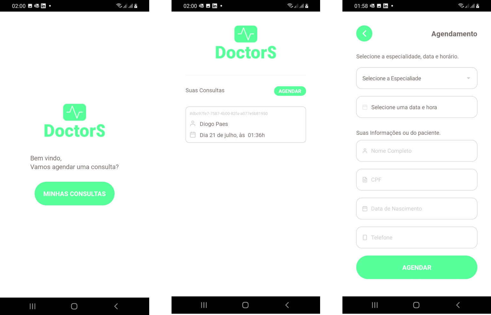

<h1 align="center">
  
  </br>
</h1>
</br>




<p align="center">

  

  <a href="https://www.linkedin.com/in/diogopaes/">
    
  </a>

  <a href="https://github.com/diogopaes/doctorsapp/commits/main">
    
  </a>

  
</p>

<br>

## :dart: Sobre ##

O Projeto DoctorS foi desenvolvido para um teste técnico, ele é um
Sistema de agendamento de consultas.

## :dart: Design ##

O Design foi desenvolvido por min, para fins de estudo e para quem estiver querendo dar uma olhada vou deixar o link.

- [Figma](https://www.figma.com/file/sbMOiPZHHq85JOANpC8c3m/doctorsapp?node-id=0%3A1)

## :rocket: Tecnologias ##

As seguintes tecnologias foram utilizadas no projeto:

- [React Native](https://reactnative.dev/)
- [React Hook Form](https://react-hook-form.com/)
- [Styled Componets](https://styled-components.com/)
- [React Native Toast Message](https://github.com/calintamas/react-native-toast-message)
- [Yup](https://github.com/jquense/yup)
- [Picker](@react-native-picker/picker)
- [React Native Vector Icons](https://github.com/oblador/react-native-vector-icons)
- [React Native Date Picker](https://github.com/henninghall/react-native-date-picker)
- [Date Fns](https://date-fns.org/)

## :white_check_mark: Requerimentos ##

- [Node](https://nodejs.org/en/)
- [Yarn](https://yarnpkg.com/lang/en/)

## :checkered_flag: ComeçandoMobile ##

```bash
# Clone this project
$ git clone https://github.com/diogopaes/doctorsapp
# Access
$ cd doctorsapp
# Install dependencies
$ yarn install
# Run the project
$ yarn start, npx react-native run-android, npx react-native run-ios 
```

## :framed_picture: Imagens ##

</br>

♥ by Diogo Paes 👋 <a href="https://www.linkedin.com/in/diogopaes/">Talk to me!</a>